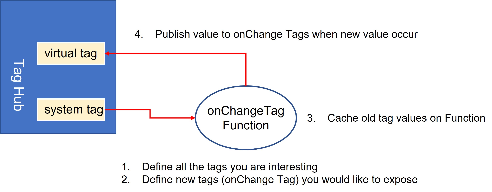
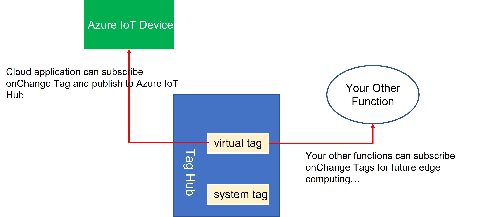

# Enable onChange Feature on TagHub

Document Version: V1.0

##### Change Log

| Version | Date       | Content          |
| ------- | ---------- | ---------------- |
| 1.0     | 2025-01-09 | Document created |

##### Applicable Products
| Product | Version |
| ------- | ------- |
| AIG-302 | 1.0 |


### Purpose

This document demonstrates how to use **Function** to extend current TagHub with onChange tag featrues.


------

### Download and Setup

1. Download [onChangeTag.tar.gz](./samples/onChangeTag.tar.gz) and unpack it.
   ```
   onChangeTag/
   - index.py
   - package.json
   ```

2. Understand package.json

   ```json
   {
     "name": "onChangeTag",
     "enabled": true,
     "trigger": {
       "driven": "dataDriven",
       "dataDriven": {
         "tags": {
           "system": {
             "status": [
               "cpuUsage"
             ]
           }
         },
         "events": {}
       },
       "timeDriven": {
         "mode": "boot",
         "intervalSec": 1,
         "cronJob": ""
       }
     },
     "expose": {
       "tags": [
         {
           "prvdName": "virtual",
           "srcName": "onChange",
           "tagName": "cpuUsage",
           "dataType": "double",
           "access": "rw"
         }
       ]
     },
     "executable": {
       "language": "python"
     },
     "params": {}
   }
   ```

   - This function configured with data-driven pattern, and declare below tags to subscribe
     - tag(**system/status/cpuUsage**)
   - It is free to add others tags under subscribe list. Once the value of subscribed tags be updated, tpFunc will call the method, **onChangeTag()** , which defined in index.py.
   - For each subscribe tags, it is make sense to define associated "onChange" Tag, such as
     - tag(**system/status/cpuUsage**) associated with tag(**virtual/onChange/cpuUsage**) 
   - Please aware that "onChange" tag shall has same dataType with it's origin, and with "read/write" access attribute.

3. Understand index.py

   ```python
   from thingspro.edge.tag_v1 import tag as tpeTAG
   
   cacheValue = {}
   cacheValue["cpuUsage"] = None
   
   def onChangeTag(_type, data):    
       publisher = tpeTAG.Publisher()
       
       if (_type == "tag"):
           if (data["prvdName"]=="system") and (data["srcName"] == "status") and (data["tagName"] == "cpuUsage"):
               if (cacheValue["cpuUsage"] == None) or (cacheValue["cpuUsage"] != data["dataValue"]):   
                   print("Cache value of virtual/onChange/cpuUsage : " + str(cacheValue["cpuUsage"]))             
                   newTag = {
                       'prvdName': "virtual",
                       'srcName': "onChange",
                       'tagName': "cpuUsage",            
                       'dataValue': data["dataValue"],
                       'dataType' : "double",
                       'ts': data["ts"]
                       }    
                   publisher.publish(newTag)                
                   print("updated virtual/onChange/cpuUsage by new vlaue: " + str(data["dataValue"]))
                   cacheValue["cpuUsage"] = data["dataValue"]
   ```

   - cacheValue is python dict object, which be used to store onChange Tags value in RAM.

   - onChangeTag() method, shall be with same named as 'function name' in package.json.

   - onChangeTag() compares incoming Tag value with cacheValue, and publish Tag value to onChange Tag if them are different, like below diagram.

     <p align="center" width="100%"></p>


### Tips

When onChangeTag function running, other applications or functions could subscribe these onChange Tags, when needed, to reduce complexity of these applications implementation.

<p align="center" width="100%"></p>

