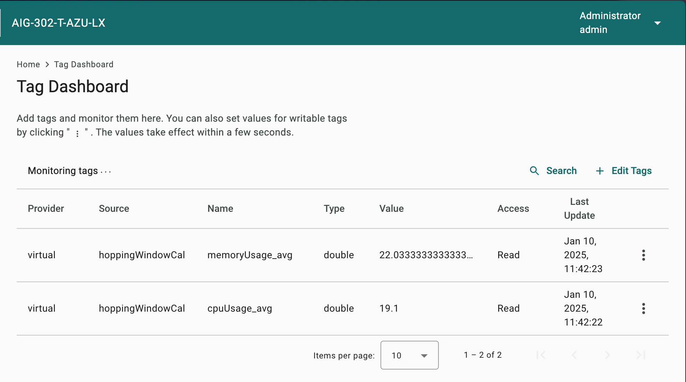

# Virtual Tags by Hopping Window 

Document Version: V1.0

##### Change Log

| Version | Date       | Content          |
| ------- | ---------- | ---------------- |
| 1.0     | 2025-01-10 | Document created |

##### Applicable Products
| Product | Version |
| ------- | ------- |
| AIG-302 | 1.0 |


### Purpose

This document demonstrates how to use **Function** to create virtual tags which calculate via hopping window pattern.

Note: for more information about hopping window, please refer to [this article](https://learn.microsoft.com/en-us/stream-analytics-query/hopping-window-azure-stream-analytics).

------

### Download and Setup

1. Download [hopping_window.tar.gz](./samples/hopping_window.tar.gz) and unpack it.
    ```
    hopping_window/
    - index.py
    - package.json
    ```
    - This function creates two new tags (cpuUsage_avg, memoryUsage_avg) which calculate cpuUsage and memoryUsage value by specified hopping window.
    - You can monitor these two new tags on AIG Web by click **Tag Dashboard** and select these two tags.
      

2. Understand package.json
    ```json
    {
      "name": "hoppingWindowCal",
      "enabled": true,
      "trigger": {
        "driven": "timeDriven",
        "dataDriven": {
          "tags": {},
          "events": {}
        },
        "timeDriven": {
          "mode": "boot",
          "intervalSec": 1,
          "cronJob": ""
        }
      },
      "expose": {
        "tags": []
      },
      "executable": {
        "language": "python"
      },
      "params": {
        "hoppingWindowsSec": 60,
        "calMethod": "average",
        "tags": [
          {
            "sourceTag": {
              "prvdName": "system",
              "srcName": "status",
              "tagName": "cpuUsage"
            },
            "virtualTag": {
              "prvdName": "virtual",
              "srcName": "hoppingWindowCal",
              "tagName": "cpuUsage_avg",
              "dataType": "double"
            }
          },
          {
            "sourceTag": {
              "prvdName": "system",
              "srcName": "status",
              "tagName": "memoryUsage"
            },
            "virtualTag": {
              "prvdName": "virtual",
              "srcName": "hoppingWindowCal",
              "tagName": "memoryUsage_avg",
              "dataType": "double"
            }
          }
        ]
      }
    }
    ```

   | Key               | Description                                                  |
   | ----------------- | ------------------------------------------------------------ |
   | hoppingWindowsSec | Hopping Window length in seconds                             |
   | calMethod         | "average": Average value of all valid records<br />"counter": Valid record numbers |
   | tags/sourceTag    | The origin tag you desired                                 |
   | tags/virtualTag   | The new tag you desired, the tag value will be output of hopping window |

   Note: **tags** support array type.

